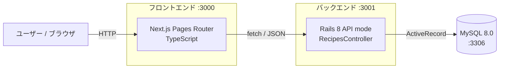

# RecipeManager

家庭で使うレシピを登録・検索・編集できる Web アプリ。**Next.js (Pages Router) + Ruby on Rails (API mode) + MySQL** という構成で、フロントエンド / バックエンド / DB を分離した実用的な SPA を一人で設計・実装した個人開発プロジェクト。

モダンなフロントエンドフレームワーク（Next.js / TypeScript）と、堅牢な Web API フレームワーク（Rails 8 API mode）を連携させる構成を、要件定義 → 設計 → 実装 → ドキュメント化まで通しで行うことを目的としている。

## デモ

実際の操作を録画したデモ動画です。

<!-- TODO: GitHub Issue/PR にアップロードした動画の user-attachments URL をここに貼る -->
<!-- 例:
https://github.com/user-attachments/assets/xxxxxxxx-xxxx-xxxx-xxxx-xxxxxxxxxxxx
-->

> 動画は別 Issue で追加予定です。

## 機能一覧

| カテゴリ | 機能 |
| --- | --- |
| レシピ管理 (CRUD) | レシピの新規登録 / 一覧表示 / 詳細表示 / 編集 / 削除 |
| 入力項目 | タイトル / カテゴリ（和食・洋食・中華・その他）/ 材料（名前・分量・単位の動的追加）/ 作り方（手順の動的追加・並び替え）/ 何人分 / 調理時間 / メモ |
| 検索 | キーワード検索（タイトル部分一致 / 300ms デバウンス） |
| 絞り込み | カテゴリでの絞り込み |
| 並べ替え | 新着順 / タイトル昇順 |
| バリデーション | 必須チェック / 最大文字数 / 数値範囲 / 材料・手順 1 件以上 |
| UX | 削除前の確認モーダル / パンくずナビ / 共通レイアウト |

スコープ外: 認証、画像アップロード、タグ機能。

## アーキテクチャ



- フロントエンドは Next.js の Pages Router を採用し、`/recipes`, `/recipes/[id]`, `/recipes/new`, `/recipes/[id]/edit` の 4 ルートで CRUD 画面を提供
- バックエンドは Rails を **API mode** で構築し、`/api/recipes` の RESTful エンドポイントを公開
- レシピの「材料」「作り方」は MySQL の **JSON 型カラム** に格納し、単一テーブル構成を維持しながら柔軟な構造化データを扱う

## 技術スタック

| レイヤ | 採用技術 |
| --- | --- |
| フロントエンド | Next.js 16 (Pages Router) + TypeScript |
| バックエンド | Ruby on Rails 8.1 (API mode) |
| データベース | MySQL 8.0 |
| インフラ（開発） | Docker Compose（MySQL + backend） |

詳細は [docs/技術スタック.md](docs/技術スタック.md) を参照。

## 工夫した点

- **検索体験**: キーワード入力に 300ms のデバウンスをかけ、入力中の過剰な API リクエストを抑制
- **動的フォーム**: 材料・手順を任意件数で追加 / 削除 / 並び替えできる UI を実装し、レシピ特有の構造化データに対応
- **バリデーションの二重化**: フロントの入力チェックに加え、Rails 側でも必須・最大長・数値範囲・配列要素 1 件以上の検証を行い、API 単体でも整合性を担保
- **ドキュメント駆動**: 要件定義書 / 機能仕様書 / 画面設計書 / 画面遷移図 / ER 図 / 開発計画書 を [docs/](docs/) に整備し、設計 → 実装が一貫する形で進行
- **運用ルールの明文化**: ブランチ命名 / Issue → PR の流れ / ポート規定を [CLAUDE.md](CLAUDE.md) に集約し、個人開発でも線形履歴・PR レビュー前提のワークフローを徹底
- **ポート競合の運用ルール**: Next.js (3000) と Rails (デフォルト 3000) の衝突を Rails 側 3001 に固定。「別ポートに逃げず占有プロセスを止める」ルールを明文化し、README / Docker Compose と動作環境のズレを防止

## ディレクトリ構成

```
RecipeManager/
├── frontend/          # Next.js (Pages Router)
├── backend/           # Rails API
├── docs/              # 要件定義 / 機能仕様 / 画面設計 / ER 図 等
├── prototype/         # 静的 HTML/CSS/JS の UI モック
└── docker-compose.yml # MySQL + backend を起動するコンポーズ
```

## ポート規定

別ポートでの代替起動は禁止（[CLAUDE.md](CLAUDE.md) 参照）。競合時は占有プロセスを停止して規定ポートで起動し直すこと。

| サービス | ポート |
| --- | --- |
| フロントエンド (Next.js) | `3000` |
| バックエンド (Rails API) | `3001` |
| MySQL | `3306` |

## セットアップ

### 1. 前提

- Node.js 22 系 / npm 11 系（`frontend/package.json` の `volta` に固定）
- Ruby 3.4.9（`backend/.ruby-version`）
- MySQL 8.0（ローカルまたは Docker）

### 2. 環境変数

各 `.env.example` をコピーして使う。

```bash
cp .env.example .env                       # ルート（docker compose 用）
cp backend/.env.example backend/.env       # Rails ローカル起動用
cp frontend/.env.local.example frontend/.env.local
```

主な変数:

| ファイル | キー | 説明 |
| --- | --- | --- |
| `backend/.env` | `DB_USERNAME` / `DB_PASSWORD` | MySQL 接続情報 |
| `backend/.env` | `DB_HOST` | ローカル MySQL は `127.0.0.1`、Docker Compose 経由は `db` |
| `frontend/.env.local` | `NEXT_PUBLIC_API_BASE` | API のベース URL（既定: `http://localhost:3001/api`） |

### 3. 依存関係

```bash
cd backend && bundle install && cd ..
cd frontend && npm install && cd ..
```

## 起動手順

以下の順で 3 サービスを起動する。

### A. ローカル起動

1. **MySQL** を 3306 で起動

2. **バックエンド**（Rails API）

   ```bash
   cd backend
   bin/rails db:create db:migrate    # 初回のみ
   bin/rails s -p 3001
   ```

3. **フロントエンド**（Next.js）

   ```bash
   cd frontend
   npm run dev                       # http://localhost:3000
   ```

4. ブラウザで http://localhost:3000 を開く（`/recipes` へリダイレクト）。

### B. Docker Compose（MySQL + backend）

```bash
docker compose up -d
docker compose exec backend bin/rails db:create db:migrate   # 初回のみ
```

フロントエンドは別タブで `cd frontend && npm run dev` を起動する。

## 動作確認シナリオ

ブラウザで CRUD + 検索を以下の順で一巡する:

1. **登録**: ヘッダー右の「+ 新規登録」→ タイトル / カテゴリ / 材料 / 手順 / 人数 / 調理時間 / メモを入力 → 登録
2. **一覧**: `/recipes` でカードグリッド表示を確認
3. **検索 / 絞り込み / 並べ替え**: キーワード（300ms デバウンス）/ カテゴリ / 並び順
4. **詳細**: カード → 詳細画面で材料・作り方を確認
5. **編集**: 「編集」ボタン → 値を変更して更新
6. **削除**: 詳細から削除 → 確認モーダルで「削除する」→ 一覧へ戻る

API 単体は `curl` でも確認できる:

```bash
curl http://localhost:3001/api/recipes
curl http://localhost:3001/api/recipes/1
```

## よく使うコマンド

| コマンド | 用途 |
| --- | --- |
| `cd frontend && npm run dev` | フロント開発サーバ |
| `cd frontend && npm run lint` | ESLint |
| `cd frontend && npm run typecheck` | 型チェック |
| `cd frontend && npm run build` | プロダクションビルド |
| `cd backend && bin/rails s -p 3001` | Rails API |
| `cd backend && bin/rails db:migrate` | マイグレーション |
| `cd backend && bin/rails c` | Rails コンソール |

## ドキュメント

- [要件定義書](docs/要件定義書.md)
- [機能仕様書](docs/機能仕様書.md)
- [画面設計書](docs/画面設計書.md) / [画面遷移図](docs/画面遷移図.md)
- [ER 図](docs/ER図.md)
- [開発計画書](docs/開発計画書.md)
- [運用ルール（ブランチ / PR / ポート）](CLAUDE.md)
