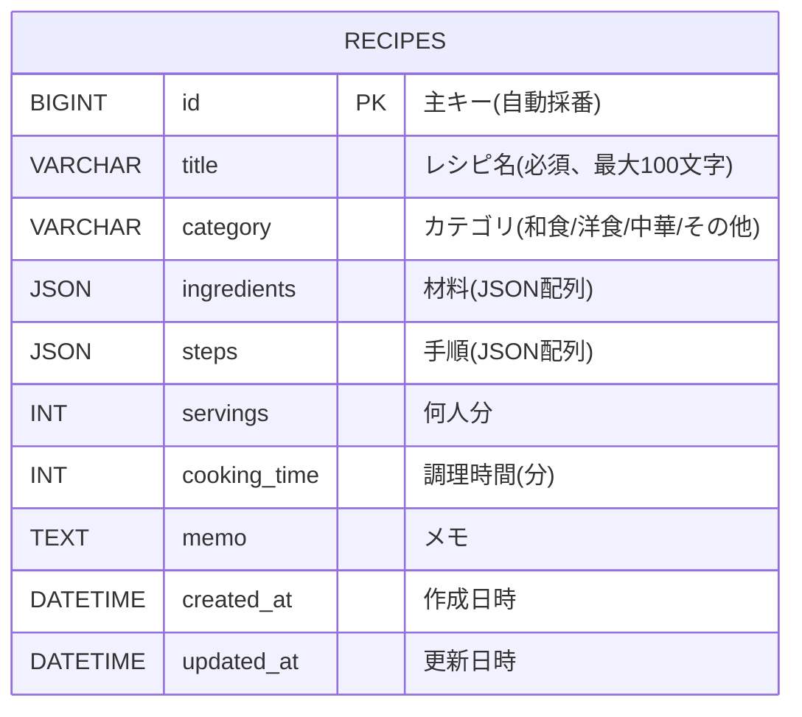

# レシピ管理アプリ ER図

## ER図(Mermaid)



## 補足

本アプリは個人利用前提の最小構成のため、テーブルは `recipes` 1 つのみ。
材料(ingredients)・手順(steps)は別テーブルではなく、JSON カラムとして格納する。

### JSON 構造

#### ingredients
```json
[
  { "name": "玉ねぎ", "amount": "1個" },
  { "name": "豚肉",   "amount": "200g" }
]
```

#### steps
```json
[
  { "order": 1, "description": "玉ねぎを切る" },
  { "order": 2, "description": "炒める" }
]
```
