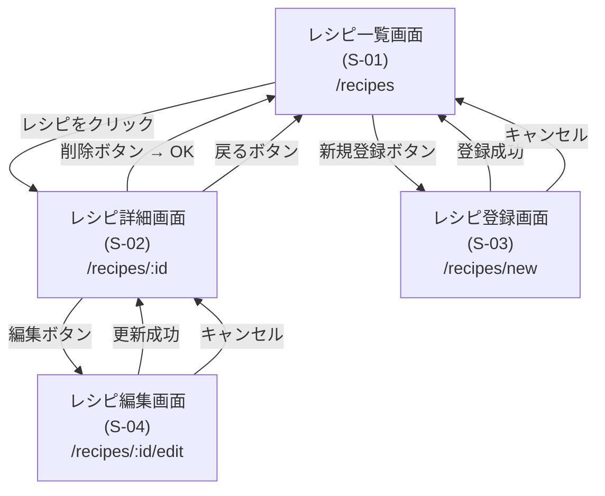

# レシピ管理アプリ 画面遷移図

## 画面遷移図(Mermaid)

## 画面一覧

| 画面 ID | 画面名 | URL |
|---------|--------|------|
| S-01 | レシピ一覧画面 | `/recipes` |
| S-02 | レシピ詳細画面 | `/recipes/:id` |
| S-03 | レシピ登録画面 | `/recipes/new` |
| S-04 | レシピ編集画面 | `/recipes/:id/edit` |
